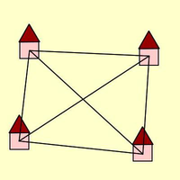

# Elaborato Operating Systems @UNIVR - Unix Syscalls with C
This is the project required for the Univr O.S. programming course i've taken.

## RUNNING and COMPILATION
You may compile this program like so:
```sh
$ make
```
The requirements are:
* a Unix operating system
* the gcc C compiler
* the make automated compilation mechanism

To see further available compiling options type:
```sh
$ make help
```

## FILES
#### Source directories:
- `src/` contains the main .c source code
- `src/include/` contains the main .h header files, proving an interface to the program

#### Source code:
- [main.c] is the main program file
- [lib_io.c] provides io functionality, mainly regarding the parsing of strings `char *`
- [lib_ipc.c] provides shared IPC functionality
- [lib_error.c] provides some error handling functionality, and the fantastic `debugf()` function :smile:
[main.c]: src/main.c
[lib_io.c]: src/lib_io.c
[lib_ipc.c]: src/lib_ipc.c
[lib_error.c]: src/lib_error.c

_All .c source files are coupled with a realated .h header file, except for the main.c file._

#### Binary directories: (after compilation)
- `bin/` contains the main program
- `bin/obj/` contains all the object files that need to be linked together

_All .c source files are coupled with a related .o object file in `bin/obj/`._

#### Documentation directories: (after compilation)
- `doc/html/` contains the HTML documentation for the source code, which i strongly advise reading if interested. Just load `index.html` in your browser. :wink:

#### Misc files:
- `Makefile` contains all automated compilation instructions for make
- `Doxyfile` contains all automated compilation instructions for the Doxygen documentation
- `Elaborato2.pdf` contains the italian description for the project requirements which i have fulfilled
- `LICENSE` contains all info on the copyright and license for this project
-  is the icon used in the Doxygen documentation
- `input.txt` is an input test file for the program, a corrensponding [output](output.txt) file is provided as well

[Makefile]: Makefile
[Doxyfile]: Doxyfile
[Elaborato2.pdf]: Elaborato2.pdf
[LICENSE]: LICENSE
[logo]: icon.png
[input.txt]: input.txt

## DOCUMENTATION
More information on the source code may be found by compiling the Doxygen documentation,
embedded in the document through special Doxygen-type comments.

To compile the documentation:
```sh
$ make doc
```

The requirements are:
* Doxygen

### LICENSE
A license file is provided in `LICENSE`, and further information may be found in the source files.
